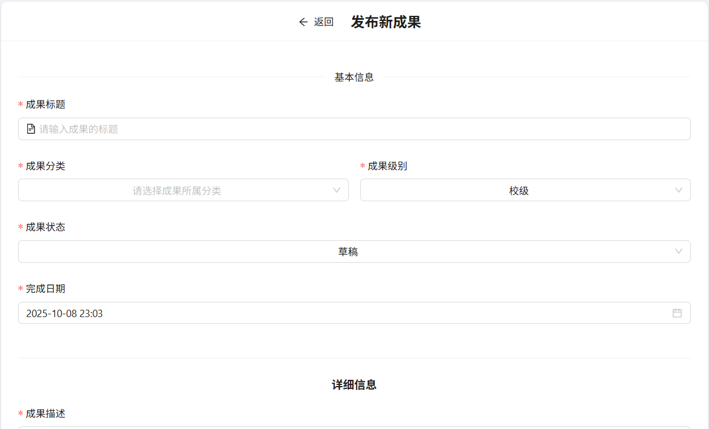
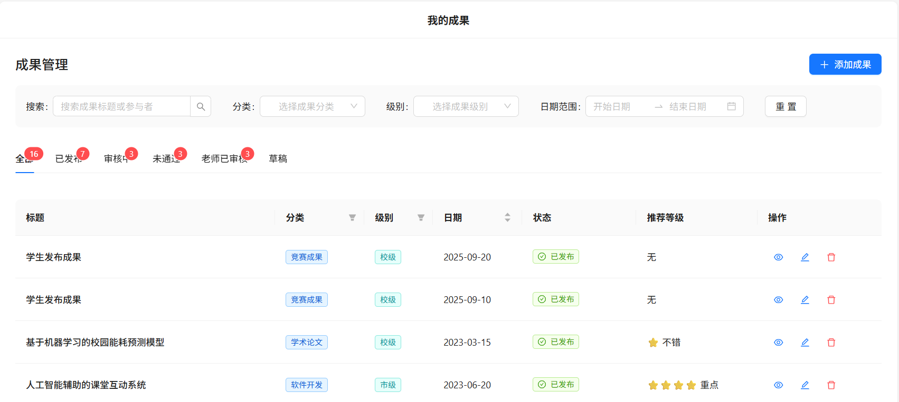
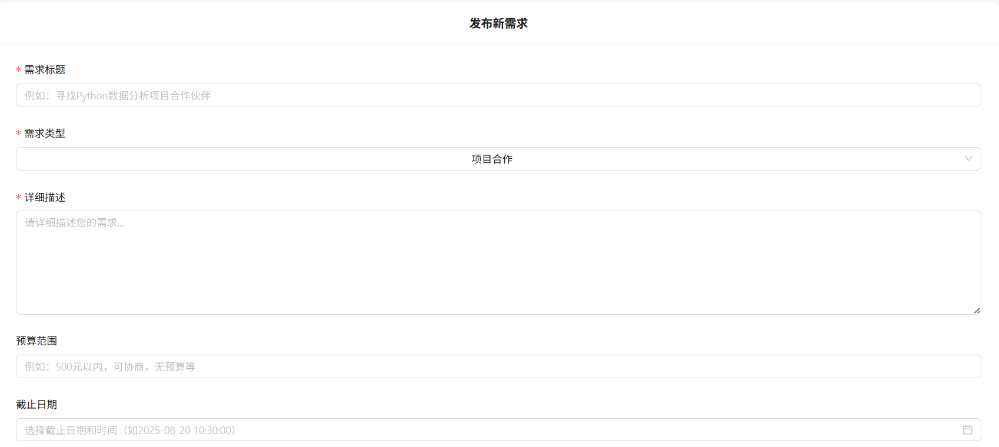
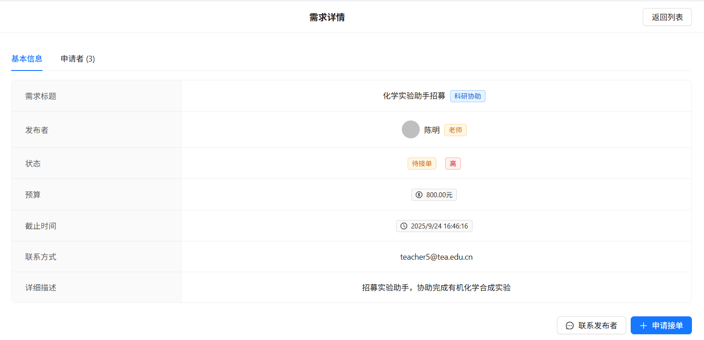
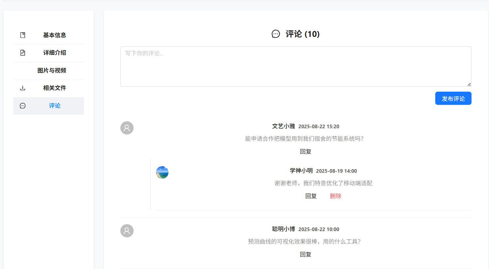
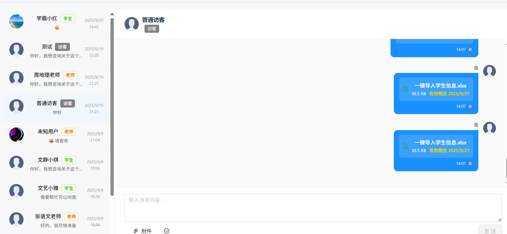
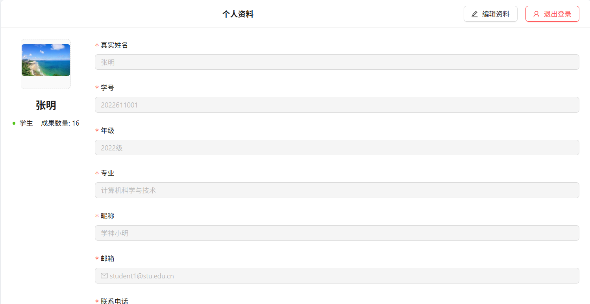

### 平台使用说明

1. **发布成果**：在个人中心或指定区点“发布成果”，填名称、描述等，传附件，提交待审核。

2. **查成果审核进度**：在个人中心“我的成果”里，看成果状态。

3. **发布需求**：登录后点“发布需求”，填标题、描述等信息，提交待管理员审核。

4. **申请接单**：在“需求广场”选意向需求，点“申请接单”(可填说明)，等发布方确认。

5. **评论**：在对应页面“评论”区输内容，点“发布”(该部分
需管理员审核后方可显示)。

6. **聊天**：进“消息”界面选沟通对象，可发文字、表情;点“文件”传文件，可选择文件有效时间。

7. **个人中心**：点头像进个人中心，可查信息、改密码、更新资料。

